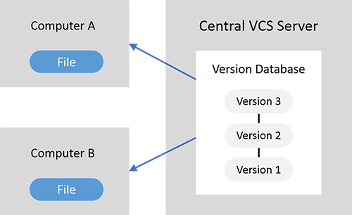
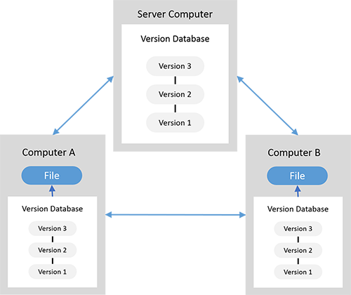

# Git Advance

开源的分布式版本管理系统(VCS)

Linus Torvalds用于管理Linux Kernel源代码

# 分布式的理解

- 本地版本控制

- 集中版本控制(CVS)：中央服务器单点故障

  

- 分布版本控制

# 存储方式

- 大多数：存储的是变更，累加所有变更得到最终的版本
- Git：修改则快照整个文件，不修改只存指针。在Git的分支操作高效、节省存储空间（1、存压缩格式 2、打包文件存储方式）

#  三个区域四种状态

- 三个区域
  - Working Directory
  - Staging Area
  - .git directory(Repository)
- 四种状态
  - Untracked（工作区）
  - Unmodified（仓库）
  - Modified（工作区）
  - Staged（暂存区）

# Git GUI

- Git GUI

  ​

- Source Tree

- EGit