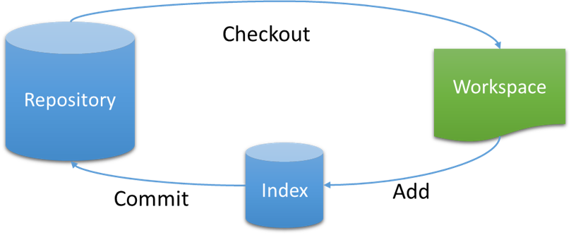

# Hello Git

免费、开源的分布式版本控制系统

## 工具

- 命令行
  - **Bash** 、Cmd、Power Shell
- GUI
  - Git GUI、GitHub Desktop
- IDE集成
  - VS、Eclipse、IntelliJ IDE

## Git Bash

- 更改样式
- 在某一目录下右键，点击Git Bash Here
- `git --version`
- 若需输入中文，可进行设置
- 命令
  - cd (change directory)、mkdir (make directory)、pwd (print working directory)、ls -a
  - mv (move)可改名、cp (copy)、rm (remove)
  - touch a 创建文件
  - echo 'asd' 打印、echo 'asd' > a.txt 存入
  - cat a.txt 显示
  - .. 上级目录、~默认目录、-上一次工作目录
  - clear (ctrl + l)、ctrl+c
  - '\' 用于命令换行
  - Vim操作

## 设置参数

- 显示Git配置
  - `git config --list`
- 设置提交仓库时的信息
  - `git config --global user.name "aaa"`
  - `git config --global user.email "123@456"`

## Git本地

- 简介

  - Workspace：工作区
  - Index/Staging Area：暂存区，控制提交的颗粒度
  - Repository：仓库区（本地）

  

- 新建代码仓库

  - 在当前目录新建一个Git代码库

    `git init`

  - 下载项目

    `git clone [url]`

    `url: https://github.com/[userName]/reposName`

- 添加删除文件

  - 添加指定文件到暂存区

    `git add [file1][file2]`

    `git add README.md`

    `git add .`

    `git add '*.txt'`

  - 删除工作区文件，并且将这次删除放入暂存区

    `git rm [file1] [file2]`

  - 改名文件，并且将这个改名放入暂存区

    `git mv [file-origin] [file-renamed]`

- 代码提交

  - 提交暂存区到仓库

    `git commit -m [message]`

    `git commit -m "the first commit"`

  - 直接从工作区提交到仓库（该文件已在仓库中有历史版本）

    `git commit -a -m [mesage]`

- 查看信息

  - 显示变更信息

    `git status`

  - 查看具体信息-shift+insert粘贴

    `git show [hash]`

  - 显示当前分支的历史版本

    `git log`

    `git log --oneline`

    `git log --summary` 

    按q键退出

## Git远程

- 简介
  - Workspace：工作区
  - Index/Stage：暂存区，控制提交的颗粒度
  - Repository：仓库区（本地）
  - Remote：远程仓库（GitHub）

- 同步远程仓库

  - 增加远程仓库并命名（与远程仓库进行连接）

    `git remote -v`

    `git remote add [shortname] [url]`

    `git remote add origin https://`

    `git remote rm origin `

    `git remote add origin git@github.com:username/test`

  - 将本地的提交推送到远程仓库

    `git push [remote] [branch]`

    `git push origin master `

    `git push`

  - 将远程仓库的提交拉下到本地

    `git pull [remote] [branch]`

    `git pull origin master`

  - 克隆到本地

    `git clone [url]`

## 练习

- try-GitHub
  - https://try.github.io/
- Git-it
  - 安装NodeJS
  - `npm install git-it --g`

